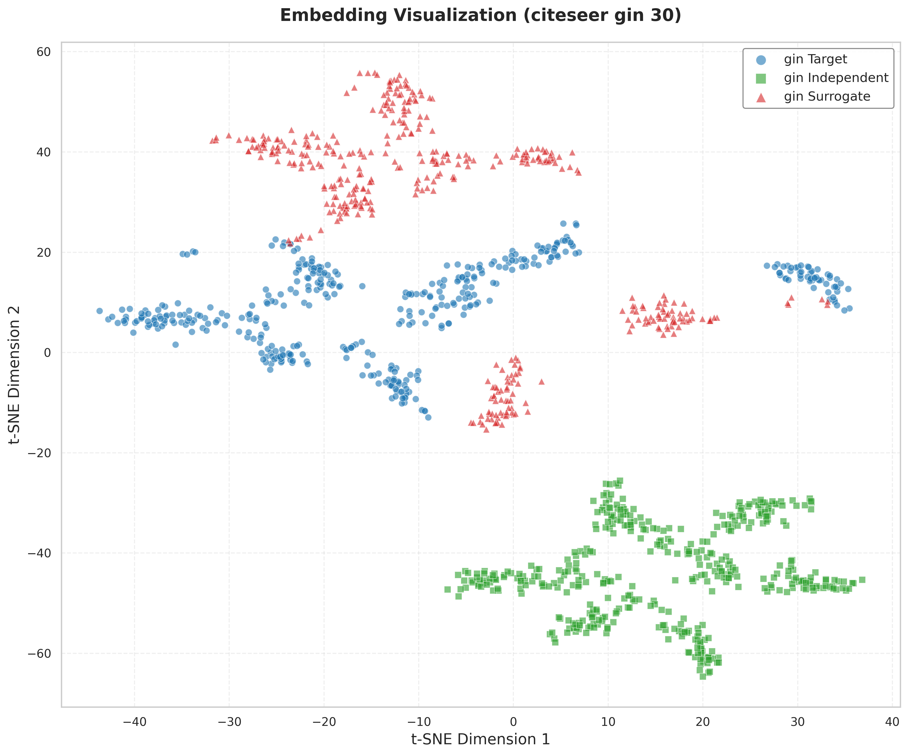
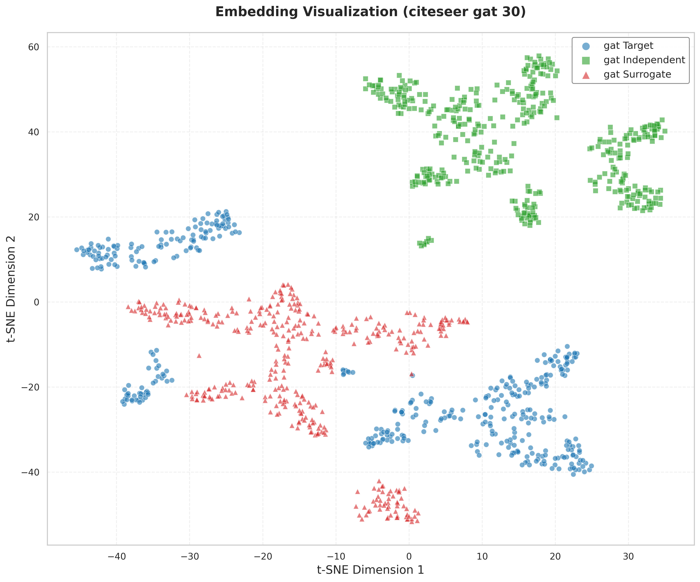
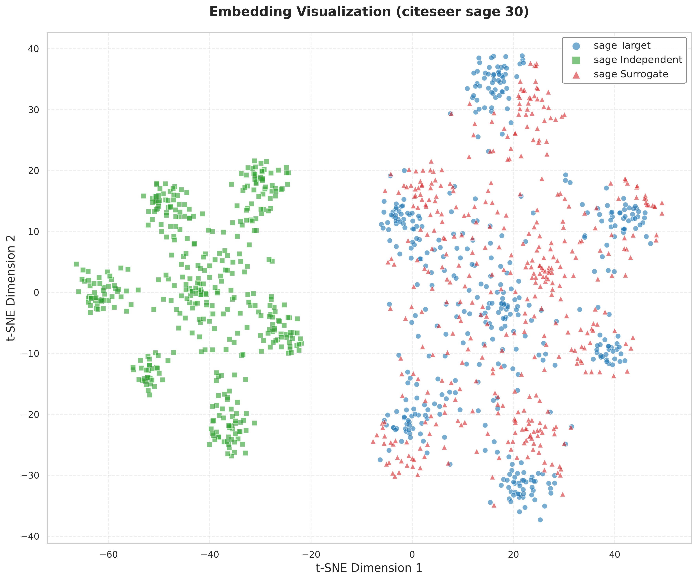

# GrOVe: Graph Neural Network Ownership Verification via Embeddings

This repository contains the code for reproducing experiments from the paper "GrOVe: Ownership Verification of Graph Neural Networks using Embeddings"

## Installation 

### Using Docker Compose

1. Install Docker Desktop for Windows from [Docker's official website](https://www.docker.com/products/docker-desktop/)

2. Clone this repository:
```bash
git clone https://github.com/aasmanbashyal/GrOVe.git
cd GrOVe
```

3. Build and run using Docker Compose:
```bash
docker-compose up --build
```

## Dataset

The datasets used in this project can be downloaded from GitHub repository:

1. Download the datasets:
```bash
https://github.com/xinleihe/GNNStealing/tree/master/code/datasets
```

2. Place the extracted datasets in the `data/raw/` directory.


## Embedding Distribution Plots

Below are t-SNE visualizations of embeddings for different models and datasets. The captions describe the model, dataset, and perplexity value used for each plot.

- **GNN: GIN, Dataset: Citeseer, Split: non-overlapped, Perplexity: 30**

  

- **GNN: GAT, Dataset: Citeseer, Split: non-overlapped, Perplexity: 30**

  

- **GNN: GraphSAGE, Dataset: Citeseer, Split: non-overlapped, Perplexity: 30**

  

- **GNN: GIN, Dataset: Citeseer, Split: overlapped, Perplexity: 30**

  

- **GNN: GAT, Dataset: Citeseer, Split: overlapped, Perplexity: 30**

  

- **GNN: GraphSAGE, Dataset: Citeseer, Split: overlapped, Perplexity: 30**

  

- **GNN: GAT, Dataset: Coauthor, Split: non-overlapped, Perplexity: 30**

  

- **GNN: GAT, Dataset: ACM, Split: non-overlapped, Perplexity: 30**

  


## Citation

```bibtex
@article{grove2023,
  title={GrOVe: Ownership Verification of Graph Neural Networks using Embeddings},
  author={Asim Waheed, Vasisht Duddu, and N. Asokan},
  journal={arXiv preprint},
  year={2023}
}
```
## References

```
https://github.com/
ssg-research/GrOVe
```

```
https://github.com/
xinleihe/GNNStealing
```