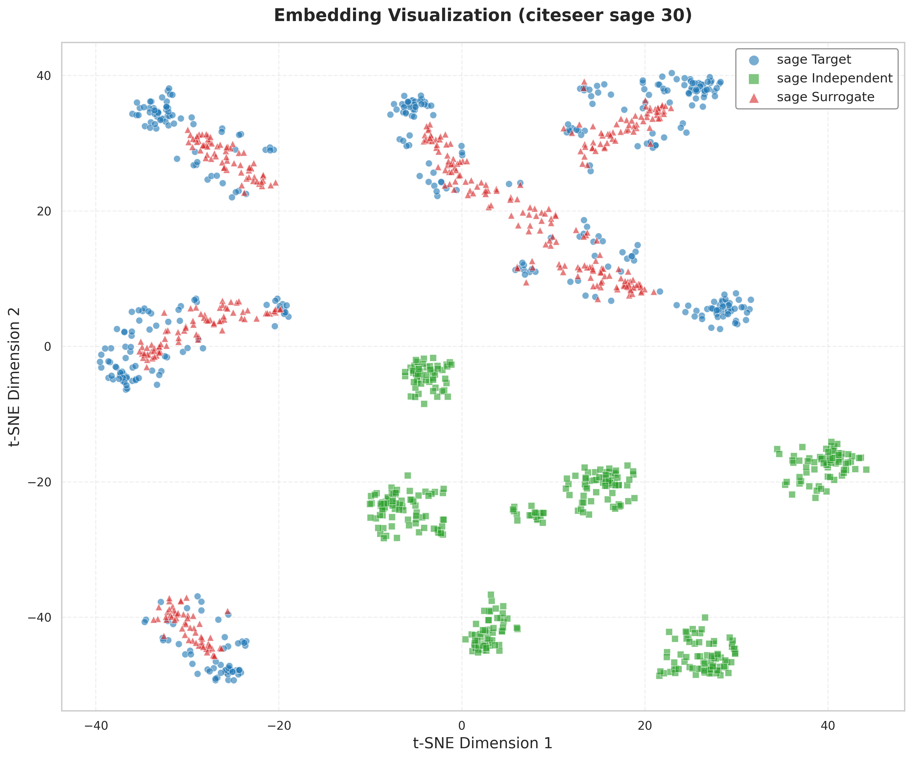
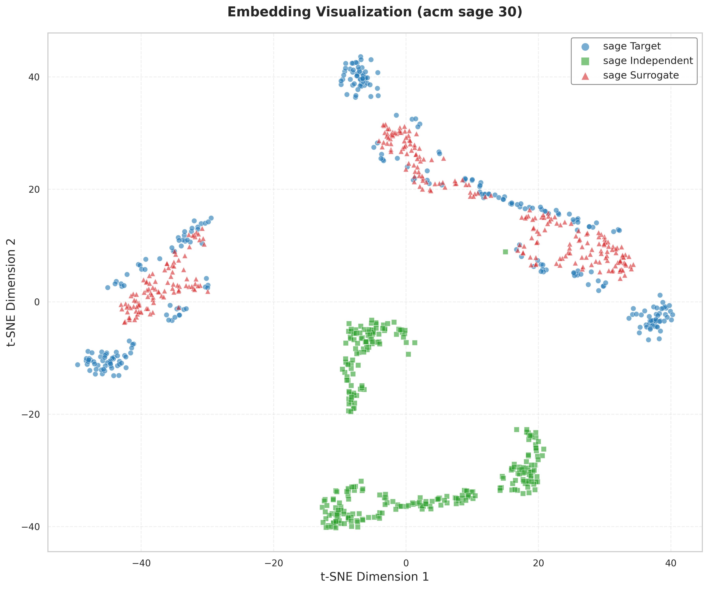

# GrOVe: Graph Neural Network Ownership Verification via Embeddings

This repository contains the code for reproducing experiments from the paper "GrOVe: Ownership Verification of Graph Neural Networks using Embeddings"

## Installation 

### Using Docker Compose

1. Install Docker Desktop for Windows from [Docker's official website](https://www.docker.com/products/docker-desktop/)

2. Clone this repository:
```bash
git clone https://github.com/aasmanbashyal/GrOVe.git
cd GrOVe
```

3. Build and run using Docker Compose:
```bash
docker-compose up --build
```

## Dataset

The datasets used in this project can be downloaded from GitHub repository:

1. Download the datasets:
```bash
https://github.com/xinleihe/GNNStealing/tree/master/code/datasets
```

2. Place the extracted datasets in the `data/raw/` directory.


## Embedding Distribution Plots

Below are t-SNE visualizations of embeddings for different models and datasets. The captions describe the model, dataset, and perplexity value used for each plot.

- **GIN, Dataset: Citeseer, Split: non-overlapped**

  

- **GAT, Dataset: Citeseer, Split: non-overlapped**

  

- **GraphSAGE, Dataset: Citeseer, Split: non-overlapped**

  


- **GAT, Dataset: ACM, Split: non-overlapped**

  

- **GIN, Dataset: ACM, Split: non-overlapped**

  

- **GraphSAGE, Dataset: ACM, Split: non-overlapped**

  

---
- **Fine-tuned GAT, Dataset: Citeseer**

  

 - **Double Extraction Type 1 GAT, Dataset: Citeseer**

   

- **Double Extraction Type 2 GAT, Dataset: Citeseer**

   

 - **Distribution Shift GAT, Dataset: Citeseer**

   
  
---
### Embedding visualization on different puring ratio

- **Pruning Ratio: 0.1 GAT, Dataset: Citeseer**

   

- **Pruning Ratio: 0.2 GAT, Dataset: Citeseer**

   

- **Pruning Ratio: 0.3 GAT, Dataset: Citeseer**

   

- **Pruning Ratio: 0.4 GAT, Dataset: Citeseer**

   

- **Pruning Ratio: 0.5 GAT, Dataset: Citeseer**

  

- **Pruning Ratio: 0.6 GAT, Dataset: Citeseer**

  

- **Pruning Ratio: 0.7 GAT, Dataset: Citeseer**

   


## Citation

```bibtex
@article{grove2023,
  title={GrOVe: Ownership Verification of Graph Neural Networks using Embeddings},
  author={Asim Waheed, Vasisht Duddu, and N. Asokan},
  journal={arXiv preprint},
  year={2023}
}
```
## References

```
https://github.com/
ssg-research/GrOVe
```

```
https://github.com/
xinleihe/GNNStealing
```