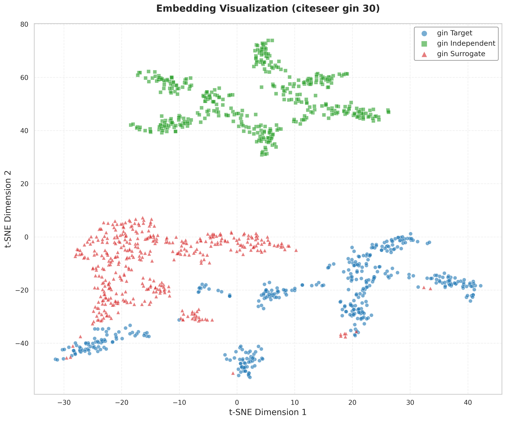

# GrOVe: Graph Neural Network Ownership Verification via Embeddings

This repository contains the code for reproducing experiments from the paper "GrOVe: Ownership Verification of Graph Neural Networks using Embeddings"

## Installation 

### Using Docker Compose

1. Install Docker Desktop for Windows from [Docker's official website](https://www.docker.com/products/docker-desktop/)

2. Clone this repository:
```bash
git clone https://github.com/aasmanbashyal/GrOVe.git
cd GrOVe
```

3. Build and run using Docker Compose:
```bash
docker-compose up --build
```

## Dataset

The datasets used in this project can be downloaded from GitHub repository:

1. Download the datasets:
```bash
https://github.com/xinleihe/GNNStealing/tree/master/code/datasets
```

2. Place the extracted datasets in the `data/raw/` directory.


## Embedding Distribution Plots

Below are t-SNE visualizations of embeddings for different models and datasets. The captions describe the model, dataset, and perplexity value used for each plot.

### Basic Model Comparisons - Non-overlapped Split

<table>
<tr>
<td align="center" width="33%">

<br><b>GIN - Citeseer Dataset</b>
</td>
<td align="center" width="33%">

<br><b>GAT - Citeseer Dataset</b>
</td>
<td align="center" width="33%">

<br><b>GraphSAGE - Citeseer Dataset</b>
</td>
</tr>
<tr>
<td align="center" width="33%">

<br><b>GAT - ACM Dataset</b>
</td>
<td align="center" width="33%">

<br><b>GIN - ACM Dataset</b>
</td>
<td align="center" width="33%">

<br><b>GraphSAGE - ACM Dataset</b>
</td>
</tr>
</table>

### Advanced Attack Techniques - GAT on Citeseer

<table>
<tr>
<td align="center" width="33%">

<br><b>Fine-tuned GAT</b>
</td>
<td align="center" width="33%">

<br><b>Double Extraction Type 1</b>
</td>
<td align="center" width="33%">

<br><b>Double Extraction Type 2</b>
</td>
</tr>
<tr>
<td align="center" width="33%">

<br><b>Distribution Shift</b>
</td>
<td align="center" width="33%">
</td>
<td align="center" width="33%">
</td>
</tr>
</table>

### Pruning Analysis - GAT on Citeseer

<table>
<tr>
<td align="center" width="33%">

<br><b>Pruning Ratio: 0.1</b>
</td>
<td align="center" width="33%">

<br><b>Pruning Ratio: 0.2</b>
</td>
<td align="center" width="33%">

<br><b>Pruning Ratio: 0.3</b>
</td>
</tr>
<tr>
<td align="center" width="33%">

<br><b>Pruning Ratio: 0.4</b>
</td>
<td align="center" width="33%">

<br><b>Pruning Ratio: 0.5</b>
</td>
<td align="center" width="33%">

<br><b>Pruning Ratio: 0.6</b>
</td>
</tr>
<tr>
<td align="center" width="33%">

<br><b>Pruning Ratio: 0.7</b>
</td>
<td align="center" width="33%">
</td>
<td align="center" width="33%">
</td>
</tr>
</table>

## Citation

```bibtex
@article{grove2023,
  title={GrOVe: Ownership Verification of Graph Neural Networks using Embeddings},
  author={Asim Waheed, Vasisht Duddu, and N. Asokan},
  journal={arXiv preprint},
  year={2023}
}
```
## References

```
https://github.com/
ssg-research/GrOVe
```

```
https://github.com/
xinleihe/GNNStealing
```