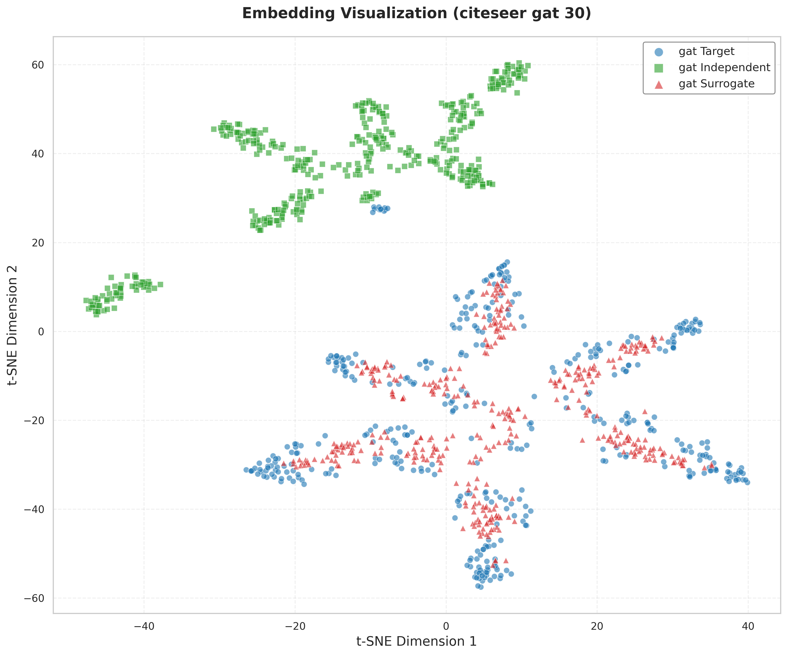
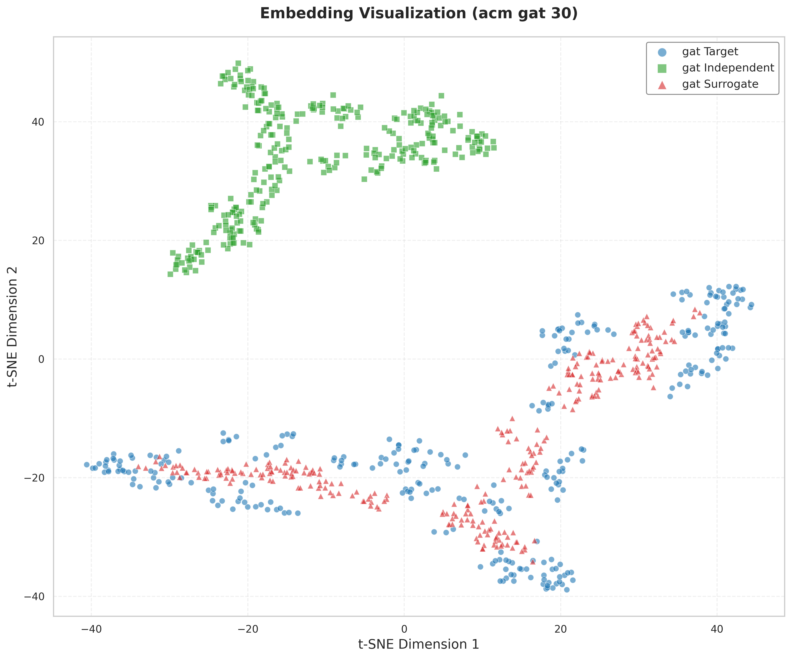

# GrOVe: Graph Neural Network Ownership Verification via Embeddings

This repository contains the code for reproducing experiments from the paper "GrOVe: Ownership Verification of Graph Neural Networks using Embeddings"

## Quick Start

### **Software Prerequisites**
- Docker and docker-compose Desktop 
- **GPU**: NVIDIA GPU with CUDA > 12.6+ 
- Git for repository cloning
- NVIDIA drivers (for GPU acceleration)

### Tested on Docker

### **Step 2: Clone & Setup**
```bash
# Clone repository
git clone https://github.com/aasmanbashyal/GrOVe.git
cd GrOVe

# Download datasets (place in data/raw/)
# From: https://github.com/xinleihe/GNNStealing/tree/master/code/datasets
mkdir -p data/raw
# Download: acm.npz, amazon.npz, citeseer.npz, coauthor.npz, dblp.npz, pubmed.npz

docker-compose up --build
```
**What happens**: Automatically runs all experiments (6 datasets × 3 models × multiple attack types)s


---

## Project Structure & File Contents

### **Core Implementation (`grove/`)**
- **`models/gnn.py`**: GNN architectures (GAT, GIN, GraphSAGE) with forward methods returning (embeddings, predictions)
- **`attacks/model_stealing.py`**: Core attack framework with SurrogateModelTrainer, DistributionShiftTrainer, Type I/II attacks
- **`attacks/evaluation.py`**: ModelEvaluator with fidelity, classification metrics, embedding similarity computation
- **`attacks/advanced_models.py`**: Sophisticated attacks (adversarial training, knowledge distillation, ensemble attacks)
- **`attacks/graph_reconstruction.py`**: Graph structure reconstruction (IDGL, KNN, random, adaptive) for Type II attacks
- **`verification/similarity_model.py`**: CSim model and OwnershipVerifier for ownership verification
- **`utils/data_loader.py`**: NPZ dataset loading, PyTorch Geometric conversion, train/val/test split creation
- **`utils/data_processing.py`**: Feature normalization, graph augmentation, data format conversion

### **Execution Scripts (`scripts/`)**
- **`run_all_experiments.sh`**: Main experiment runner (executed by docker-compose) with 5-phase pipeline
- **`all_model_stealing_evaluation.py`**: Comprehensive evaluation testing all 9 architecture combinations
- **`train_model.py`**: Target model training with configurable architectures and roles
- **`train_stealing_surrogate.py`**: Surrogate model training with advanced attack options
- **`preprocess_data.py`**: Data preprocessing pipeline with overlapped/non-overlapped splits
- **`visualize_embeddings.py`**: t-SNE/PCA visualization with multiple perplexity values
- **`organize_results.py`**: Results organization preserving existing visualizations

### **Data & Models**
- **`data/raw/`**: Original datasets (acm.npz, amazon.npz, citeseer.npz, coauthor.npz, dblp.npz, pubmed.npz)
- **`data/processed/`**: Preprocessed data splits (query_data, val_data, test_data, verification_data)
- **`saved_models/`**: Trained target models with consistent naming convention
- **`embeddings/`**: Model embeddings for target, independent, and surrogate models

### **Results & Outputs**
- **`results/basic_attacks/`**: Type I/II attack results with CSV metrics
- **`results/advanced_attacks/`**: Sophisticated attack results (fine-tuning, double extraction, pruning)
- **`results/comprehensive_evaluation/`**: Complete evaluation reports with analysis text files
- **`results/visualizations/`**: t-SNE plots with unique timestamped directories
- **`results/tables/`**: Summary CSV files aggregating all results

---

## Execution Flow (`docker-compose up`)

### **Phase 1: Basic Experimental Pipeline**
1. **Data Preprocessing**: Load NPZ files → Create non-overlapped splits → PyTorch Geometric format
2. **Target Training**: Train GAT/GIN/SAGE models using train split with seed 42
3. **Independent Training**: Train baseline models for comparison with seed 789
4. **Basic Attacks**: 
   - Type I (original structure): Query target → Train surrogate on original graph
   - Type II (IDGL structure): Query target → Reconstruct graph → Train surrogate
5. **Visualization**: Generate t-SNE plots comparing target/independent/surrogate embeddings

### **Phase 2: Advanced Attacks**
- **Fine-tuning attacks**: Improved surrogate training with pre-trained initialization
- **Double extraction**: Two-stage attack strategy for enhanced performance
- **Distribution shift**: Attacks with noise/transformations during training
- **Pruning attacks**: Test robustness against pruned targets (0.3, 0.5, 0.7 ratios)

### **Phase 3: CSim Training & Verification**
- **CSim model training**: Learn similarity metrics using grid search optimization
- **Ownership verification**: Test verification on surrogate models with threshold 0.5

### **Phase 4: Comprehensive Evaluation**
- **Cross-architecture testing**: All 9 combinations (GAT/GIN/SAGE target × GAT/GIN/SAGE surrogate)
- **Recovery methods**: Test both embedding-based and prediction-based attacks
- **Metric computation**: Fidelity, accuracy, embedding similarity, KL divergence
- **Report generation**: CSV files and comprehensive analysis text reports

### **Phase 5: Results Organization**
- **File organization**: Move results to structured directories preserving existing files
- **Summary generation**: Create aggregated CSV tables and overall summaries

---

## Results Structure & Contents

### **Key Result Files**
| File Type | Location | Contents |
|-----------|----------|----------|
| **Main Results** | `results/comprehensive_evaluation/{dataset}/` | Model_Stealing_Evaluation_comprehensive_evaluation_{dataset}.csv |
| **Analysis Reports** | `results/comprehensive_evaluation/{dataset}/` | comprehensive_analysis_{timestamp}.txt |
| **Basic Attacks** | `results/basic_attacks/` | Type I/II attack results with detailed metrics |
| **Advanced Attacks** | `results/advanced_attacks/` | Fine-tuning, double extraction, pruning results |
| **Visualizations** | `results/visualizations/` | t-SNE embedding plots with unique directories |
| **Summary Tables** | `results/tables/` | basic_attacks_summary.csv, advanced_attacks_summary.csv, overall_results_summary.csv |

### **CSV Columns Explained**
| Column | Description | Interpretation |
|--------|-------------|----------------|
| **`fidelity`** | Agreement between target/surrogate predictions | **0.95-1.0** = Near-perfect, **0.85-0.95** = Highly successful, **0.70-0.85** = Moderate, **<0.70** = Poor |
| **`target_accuracy`** | Target model test accuracy | Reference performance baseline |
| **`surrogate_accuracy`** | Surrogate model test accuracy | Attack capability indicator |
| **`accuracy_gap`** | \|target_accuracy - surrogate_accuracy\| | **<0.05** = Excellent, **0.05-0.10** = Good, **0.10-0.20** = Moderate, **>0.20** = Poor |
| **`embedding_cosine_similarity`** | Embedding similarity (when dimensions match) | **>0.8** = High similarity, **0.5-0.8** = Moderate, **<0.5** = Low |
| **`cross_architecture`** | Different target/surrogate architectures | Tests transferability across model types |
| **`kl_divergence`** | KL divergence between probability distributions | Lower values indicate better mimicking |
| **`embedding_l2_distance`** | L2 distance between embeddings | Lower values indicate closer representations |


## Installation & Configuration

### **Prerequisites**
- Docker Desktop (recommended) 
- NVIDIA GPU with CUDA 12.6+

### **Quick Docker Setup**
```bash
# Install Docker Desktop from https://docker.com/products/docker-desktop/
# Clone and run
git clone https://github.com/aasmanbashyal/GrOVe.git
cd GrOVe
docker-compose up --build
```

### **Custom Configuration**
```bash
# Modify experiments in run_all_experiments.sh
DATASETS=("citeseer" "acm")  # Select specific datasets
MODELS=("gat" "gin")         # Select specific models  
EPOCHS=100                   # Adjust training epochs
DEVICE="cuda"                # Set device (cuda/cpu)
```

### **Manual Evaluation**
```bash
python scripts/all_model_stealing_evaluation.py \
    --dataset citeseer \
    --models-dir saved_models/non-overlapped \
    --output-dir results/custom \
    --epochs 100 \
    --include-advanced \
    --device cuda
```

---

##  Embedding Distribution Plots

Below are t-SNE visualizations of embeddings for different models and datasets. The captions describe the model, dataset, and perplexity value used for each plot.

### Basic Model Comparisons - Non-overlapped Split

<table>
<tr>
<td align="center" width="33%">

<br><b>GIN - Citeseer Dataset</b>
</td>
<td align="center" width="33%">

<br><b>GAT - Citeseer Dataset</b>
</td>
<td align="center" width="33%">

<br><b>GraphSAGE - Citeseer Dataset</b>
</td>
</tr>
<tr>
<td align="center" width="33%">

<br><b>GAT - ACM Dataset</b>
</td>
<td align="center" width="33%">

<br><b>GIN - ACM Dataset</b>
</td>
<td align="center" width="33%">

<br><b>GraphSAGE - ACM Dataset</b>
</td>
</tr>
</table>

### Advanced Attack Techniques - GAT on Citeseer

<table>
<tr>
<td align="center" width="33%">

<br><b>Fine-tuned GAT</b>
</td>
<td align="center" width="33%">

<br><b>Double Extraction Type 1</b>
</td>
<td align="center" width="33%">

<br><b>Double Extraction Type 2</b>
</td>
</tr>
<tr>
<td align="center" width="33%">

<br><b>Distribution Shift</b>
</td>
<td align="center" width="33%">
</td>
<td align="center" width="33%">
</td>
</tr>
</table>

### Pruning Analysis - GAT on Citeseer

<table>
<tr>
<td align="center" width="33%">

<br><b>Pruning Ratio: 0.1</b>
</td>
<td align="center" width="33%">

<br><b>Pruning Ratio: 0.2</b>
</td>
<td align="center" width="33%">

<br><b>Pruning Ratio: 0.3</b>
</td>
</tr>
<tr>
<td align="center" width="33%">

<br><b>Pruning Ratio: 0.4</b>
</td>
<td align="center" width="33%">

<br><b>Pruning Ratio: 0.5</b>
</td>
<td align="center" width="33%">

<br><b>Pruning Ratio: 0.6</b>
</td>
</tr>
<tr>
<td align="center" width="33%">

<br><b>Pruning Ratio: 0.7</b>
</td>
<td align="center" width="33%">
</td>
<td align="center" width="33%">
</td>
</tr>
</table>

### **Visualization Interpretation**
- **Close clusters**: Models learn similar representations
- **Overlapping points**: High functional similarity between target and surrogate
- **Distinct clusters**: Models learn different features (indicates attack failure)
- **Color coding**: Target (blue circles), Independent (green squares), Surrogate (red triangles)


## Citation

```bibtex
@article{grove2023,
  title={GrOVe: Ownership Verification of Graph Neural Networks using Embeddings},
  author={Asim Waheed, Vasisht Duddu, and N. Asokan},
  journal={arXiv preprint},
  year={2023}
}
```

## References

```
https://github.com/
ssg-research/GrOVe
```

```
https://github.com/
xinleihe/GNNStealing
```